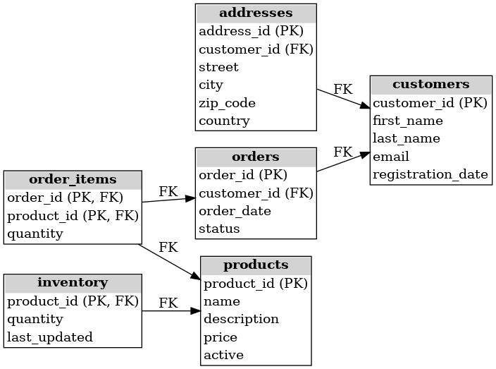

# 🛍️ E-commerce Database – ERD Diagram

This project represents the structure of a basic e-commerce database system, including customers, products, orders, inventory, and related entities.

## 🧩 Entity-Relationship Diagram

The following ERD visualizes the main entities and their relationships:

---

## 📋 Included Tables

### 1. `customers`
- `customer_id (PK)`
- `first_name`
- `last_name`
- `email`
- `registration_date`

### 2. `addresses`
- `address_id (PK)`
- `customer_id (FK)`
- `street`
- `city`
- `zip_code`
- `country`

### 3. `products`
- `product_id (PK)`
- `name`
- `description`
- `price`
- `active`

### 4. `inventory`
- `product_id (PK, FK)`
- `quantity`
- `last_updated`

### 5. `orders`
- `order_id (PK)`
- `customer_id (FK)`
- `order_date`
- `status`

### 6. `order_items`
- `order_id (PK, FK)`
- `product_id (PK, FK)`
- `quantity`

---

## 🔗 Relationships

- `addresses.customer_id` → `customers.customer_id`
- `inventory.product_id` → `products.product_id`
- `orders.customer_id` → `customers.customer_id`
- `order_items.order_id` → `orders.order_id`
- `order_items.product_id` → `products.product_id`

---

## 📂 Notes

- All tables use `INT` for identifiers and `AUTO_INCREMENT` for primary keys.
- Foreign key constraints should be added via `ALTER TABLE` after initial table creation.
- Diagram generated automatically with `graphviz`.

---

## 🧠 Useful for

- Database structure documentation
- Teaching database modeling
- Quick project onboarding
